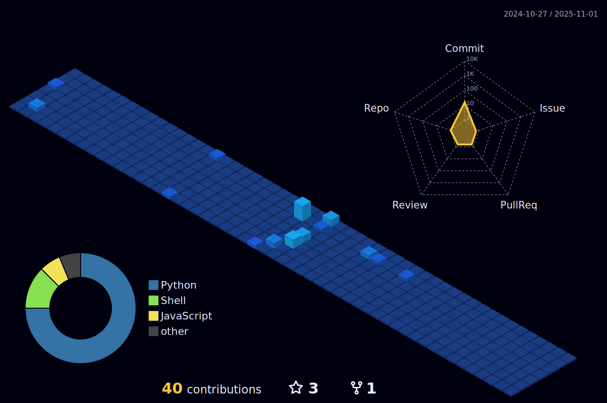

<h1 align="center">Hi , I'm < André/ ></h1>
<h3 align="center">
  
  
  
</h3>

  

- ✔ I live in Brazil 🇧🇷 
- :scroll: My Portfólio: <a href="https://andre-possan.github.io/">andre-possan.github.io</a>
- :man_student: I'm studying Front-End development at <a href="https://www.alura.com.br/">Alura</a>. 
- 📫 Contact email → **andrecorsopossan@gmail.com**

  
<h2>My Skills :man_technologist:  and  GitHub Stats :bar_chart:</h2>
  

    
    
    
    
    

  
  
  

<h1>:space_invader:	Contributions :rocket:</h1>

