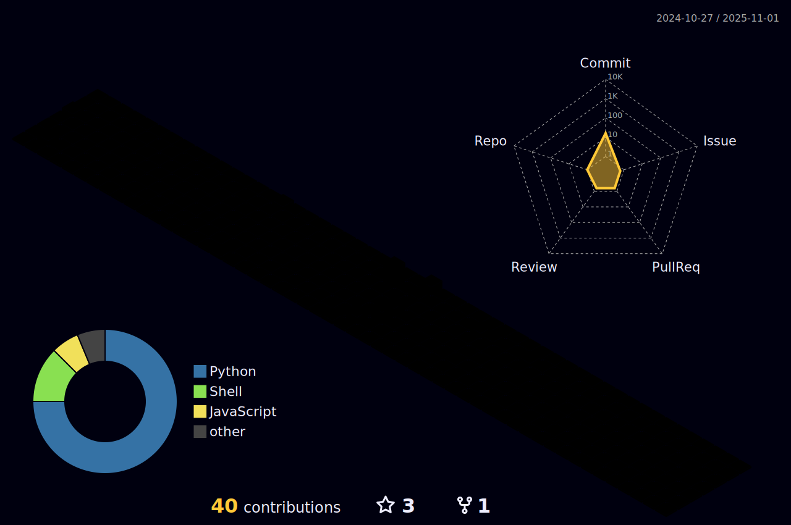

<h1 align="center">Hi , I'm < André/ ></h1>
<h3 align="center">
  
  
  
</h3>

  

  

-   ✔ I live in Brazil 🇧🇷 
-   :scroll: My Portfólio: <a href="https://andrepozzan.github.io/">andrepozzan.github.io</a>
-   :man_student: I'm studying ⚡​Electrical Engineering⚡​ at <a href="https://ufpr.br">UFPR(Federal University of Paraná)</a>.
-   I'm learning languages: English, French and Italian
-   I like to do websites and electrical circuits⚡​
-   📫 Contact email → **andrepozzan.dev@gmail.com**

<h2>My Skills :man_technologist:</h2>
  

<table align="center" width="100%">

  <tr>
    <td>
    
    </td>
    <td>
    
    </td>
    <td>
    
    </td>
    <td>
    
    </td>
  </tr>
</table>

<h1>:space_invader:	Contributions :rocket:</h1>

